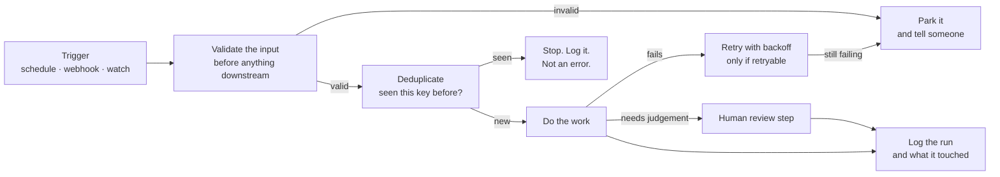

# Workflow Automation Patterns

`WORKFLOW PATTERNS`

**This is a patterns write-up, not a client case study.** It describes how I
design n8n, Make.com and Zapier workflows. Where a pattern came from a real
engagement, that engagement is named and linked. Where it did not, it is
presented as a design position and nothing more — **I am not claiming every
pattern here shipped in a client system.**

The completed client builds are in
**[automation-client-case-studies](https://github.com/skmalikllc/automation-client-case-studies)**.

---

## The difference between a demo and a system

A demo is a trigger, three nodes and a happy path. It works on the day it is
built and on no particular day after that.

A system is the same three nodes plus answers to five questions nobody asks
during the demo:

1. What happens when the API is down for ninety seconds?
2. What happens when this fires twice?
3. What happens when a field the workflow depends on is empty?
4. Who finds out when it fails, and how?
5. What happens when someone renames the thing it points at?

These are the patterns for each.

## Trigger patterns

| Pattern | When to reach for it |
|---|---|
| **Scheduled poll** | The source has no webhook, or the work is genuinely periodic — a nightly backup, a weekly report. Cheap, predictable, and late by at most one interval. |
| **Webhook** | The source can push and latency matters. Faster, but now you own delivery guarantees, signature verification and duplicate handling. |
| **Watch / changed-record trigger** | Platform-native (Airtable views, Sheets edits). Convenient — and the most fragile, because it depends on a named object continuing to exist. See *stale references* below. |
| **Manual trigger with a dry run** | Anything destructive. The first version of a migration workflow should have no write step at all. |

## The five answers

### 1. Retries — only for what a retry can fix

Retry on 429, 500, 502, 503, 504 and network timeouts. Do **not** retry a 400 or
a 401; those will be the same error forever, and five attempts just turn one bad
request into five.

Back off exponentially, and add jitter. Without jitter, every failed item in a
batch retries at the same instant and recreates the outage it is recovering
from. Working implementation:
**[api-webhook-integration-patterns → src/retry.js](https://github.com/skmalikllc/api-webhook-integration-patterns/blob/main/src/retry.js)**.

### 2. Idempotency — a workflow will fire twice

Webhook providers redeliver on a non-2xx and sometimes on a slow 2xx. A polling
workflow will re-read the same row after a partial failure. Either way, "ran
twice" must not mean "created twice".

The pattern: derive a stable key from the event, check it against a store — a
lookup table, a Data Store, a "Processed" field on the record — before the
create step, and write the key **after** the work succeeds, never before.

### 3. Validation — fail at the boundary

Check the shape of the input in the first node after the trigger, not in the
node that finally breaks. Collect every problem at once so the human who has to
fix the source data learns all of it in one message.

An empty required field is a *parking* case, not an error case: park the item,
tell someone, keep the workflow running for everything else.

### 4. Logging and alerting — know before the client does

Every run writes a line: what triggered it, what it touched, what it skipped and
why. In practice a Sheet or a table is enough, and it is the thing that turns
"the automation is broken" into an answerable question.

Alerts go to a human on **exceptions only**. An alert on every successful run is
muted within a week, and then the failure alert is muted with it.

### 5. Stale references — the failure nobody designs for

*From a real engagement.* A Make.com scenario stopped firing. The logic was
fine. The fault was a **stale Airtable View ID** — the view the trigger watched
had been replaced, so it was politely polling something that no longer existed.

This is the most common shape of "my automation broke": nothing is wrong with
the logic, something it *refers to* has moved, and the platform's error message
does not say so.

The pattern that prevents it: **treat every external ID as a dependency.** View,
table, field, folder, sheet, endpoint and webhook IDs go in the handover
documentation, and anything that can be referenced by name rather than by ID is.

Full write-up:
**[technical-troubleshooting-case-studies](https://github.com/skmalikllc/technical-troubleshooting-case-studies)**.

## Human-in-the-loop

Not everything should be automatic, and saying so is part of the design:

- **Auto-merge on a strong key** (exact reference, ID, verified email).
- **Flag for review on a weak signal** (a similar name, a near-match address).
- **Never auto-delete.** Move to an archive state that a human can reverse.

Wrongly merging or deleting two records costs far more than a person glancing at
a flagged queue. The dedupe reasoning behind this is in
**[data-sync-dedup-reconciliation](https://github.com/skmalikllc/data-sync-dedup-reconciliation)**.

## Platform notes

| | Where it fits |
|---|---|
| **n8n** | Self-hostable, code nodes when the logic outgrows the UI, straightforward branching. My default for anything with real logic in it. Verified client work: a scheduled Google Contacts backup, rated 5.0. |
| **Make.com** | Strong visual routing and error handlers. Verified client work: troubleshooting a broken Airtable-triggered scenario. |
| **Zapier** | Widest app coverage, least room to move once the logic branches. Best for genuinely linear flows. |

Choosing between them is usually decided by what the client already pays for,
not by a feature table.

## What this repository does not claim

- That every pattern above was implemented in a delivered client system. Several
  are design positions, and the ones that are not are named.
- Any node count, run volume, uptime figure or time-saved metric.
- Any client's workflow, scenario, credential or endpoint.

## Related

**[automation-client-case-studies](https://github.com/skmalikllc/automation-client-case-studies)** — the delivered builds ·
**[api-webhook-integration-patterns](https://github.com/skmalikllc/api-webhook-integration-patterns)** — the same concerns in code, with tests ·
**[n8n-google-contacts-backup](https://github.com/skmalikllc/n8n-google-contacts-backup)** — a delivered scheduled workflow ·
**[automation-portfolio](https://github.com/skmalikllc/automation-portfolio)** — the full index.
